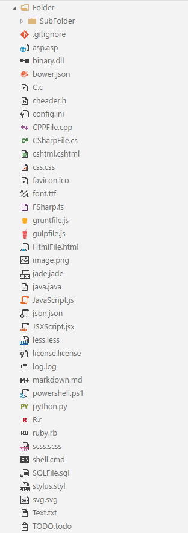

# vscode-icons-image-lib

##  [vscode-icons](https://github.com/robertohuertasm/vscode-icons) based on official Visual Studio Image Library

## Usage
See: [Custom icons support and offline icons support](https://github.com/robertohuertasm/vscode-icons#custom-icons-support-and-offline-icons-support)

In order to set your icons.zip uri you must open Preferences > User Settings and set this:
```json
{
  "vsicons.icons": "https://github.com/julianpaulozzi/vscode-icons-image-lib/icons.zip"
}

```

The default icons uri is [http://github.com/robertohuertasm/vscode-icons/blob/master/icons.zip?raw=true](http://github.com/robertohuertasm/vscode-icons/blob/master/icons.zip?raw=true).




- [Visual Studio Image Library](https://www.microsoft.com/en-us/download/details.aspx?id=35825).
- [Microsoft Software License Terms](http://download.microsoft.com/download/0/6/0/0607D8EA-9BB7-440B-A36A-A24EB8C9C67E/Visual%20Studio%202015%20Image%20Library%20EULA.docx)